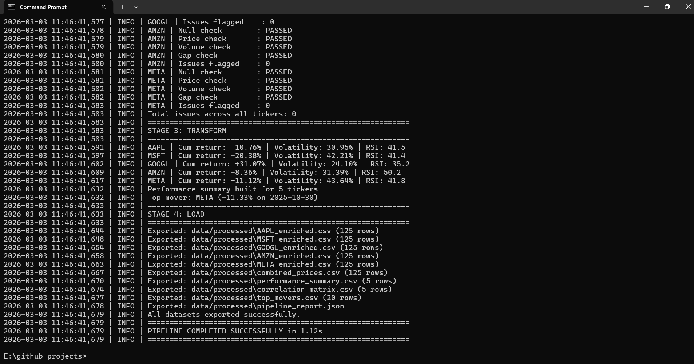

# Financial Data Pipeline

A production-style **Extract, Transform, Load (ETL)** pipeline that fetches **live stock market data** via the Yahoo Finance API, validates data quality, computes financial metrics, and exports analysis-ready datasets with full audit logging.


[](https://github.com/nithin2357-hue)

---

## Pipeline Output



---

## Project Overview

This pipeline simulates a real-world financial data engineering workflow. It connects to the **Yahoo Finance API** to pull live OHLCV (Open, High, Low, Close, Volume) data for 5 major tech stocks, processes them through a 4-stage pipeline, and produces multiple aggregated datasets for financial analysis and reporting.

**Key skills demonstrated:**
- Live API data ingestion (no static CSV files)
- Multi-ticker time-series data processing
- Financial metric engineering (RSI, moving averages, volatility)
- Automated data validation and anomaly detection
- Pipeline observability with structured logging
- SQL analytics on processed datasets

---

## Pipeline Architecture

```
Yahoo Finance API
        |
        v
  [ EXTRACT ]  ──── Fetch live OHLCV data for 5 tickers
        |
        v
  [ VALIDATE ] ──── Nulls, gaps, price/volume anomalies
        |
        v
  [ TRANSFORM ] ─── Returns, MA, Volatility, RSI, Correlation
        |
        v
  [ LOAD ]     ──── Export CSVs + JSON report + audit log
        |
        v
data/processed/
```

---

## Project Structure

```
financial_pipeline/
├── data/
│   └── processed/
│       ├── AAPL_enriched.csv         # Per-ticker enriched OHLCV data
│       ├── MSFT_enriched.csv
│       ├── GOOGL_enriched.csv
│       ├── AMZN_enriched.csv
│       ├── META_enriched.csv
│       ├── combined_prices.csv       # All close prices side by side
│       ├── performance_summary.csv   # Return, volatility, RSI per ticker
│       ├── correlation_matrix.csv    # Return correlation between tickers
│       ├── top_movers.csv            # Top 20 single-day price moves
│       └── pipeline_report.json      # JSON summary report
├── logs/
│   └── pipeline_YYYYMMDD_HHMMSS.log
├── sql/
│   └── analytics_queries.sql
├── financial_pipeline.py
├── requirements.txt
└── README.md
```

---

## Pipeline Stages

### Stage 1: Extract
- Connects to Yahoo Finance API via `yfinance`
- Fetches 6 months of daily OHLCV data for 5 tickers: AAPL, MSFT, GOOGL, AMZN, META
- Logs row count, date range, and fetch status per ticker

### Stage 2: Validate
- Detects null values across OHLCV columns
- Flags zero or negative price anomalies
- Identifies zero-volume trading days
- Detects date gaps greater than 5 calendar days

### Stage 3: Transform

**Feature Engineering (per ticker):**
| Feature | Description |
|---|---|
| `daily_return_%` | Daily percentage price change |
| `cumulative_return_%` | Total return since period start |
| `MA_7` | 7-day simple moving average |
| `MA_30` | 30-day simple moving average |
| `volatility_30d_%` | 30-day annualized rolling volatility |
| `RSI_14` | 14-day Relative Strength Index |
| `trading_range` | Daily High minus Low |

**Aggregate Outputs:**
| Dataset | Description |
|---|---|
| `combined_prices` | Close prices for all tickers aligned by date |
| `performance_summary` | Cumulative return, volatility, RSI, volume per ticker |
| `correlation_matrix` | Pairwise return correlation between all tickers |
| `top_movers` | Top 20 biggest single-day price moves across all tickers |

### Stage 4: Load
- Exports 5 enriched per-ticker CSVs
- Exports 4 aggregate datasets
- Generates a JSON summary report with top/worst performers
- Writes timestamped audit log

---

## SQL Analytics

`analytics_queries.sql` contains 8 business intelligence queries:
- Overall performance ranking by cumulative return
- Risk vs. return analysis with Sharpe proxy
- RSI signal detection (overbought/oversold)
- Top 10 single-day movers
- Average daily volume and liquidity ranking
- Moving average crossover signals
- Monthly return breakdown
- Correlation matrix summary

---

## Setup and Usage

### Requirements
- Python 3.8+
- yfinance
- pandas
- numpy

### Install dependencies
```bash
pip install -r requirements.txt
```

### Run the pipeline
```bash
python financial_pipeline.py
```

### Configuration
Edit the top of `financial_pipeline.py` to change tickers or period:
```python
TICKERS = ["AAPL", "MSFT", "GOOGL", "AMZN", "META"]
PERIOD  = "6mo"   # Options: 1mo, 3mo, 6mo, 1y, 2y
```

---

## Technologies Used

| Tool | Purpose |
|---|---|
| Python | Pipeline orchestration |
| yfinance | Live Yahoo Finance API client |
| Pandas | Data ingestion, cleaning, transformation |
| NumPy | Numerical operations and volatility calc |
| SQL | Business intelligence analytics |
| Logging | Pipeline audit trail |
| JSON | Summary report export |

---

## Author

**Nithin Kumar Reddy Panthula**
MS Cybersecurity, Auburn University at Montgomery
Atlanta, GA
[LinkedIn](https://linkedin.com/in/nithin-panthula-681855334) | [GitHub](https://github.com/nithin2357-hue)
